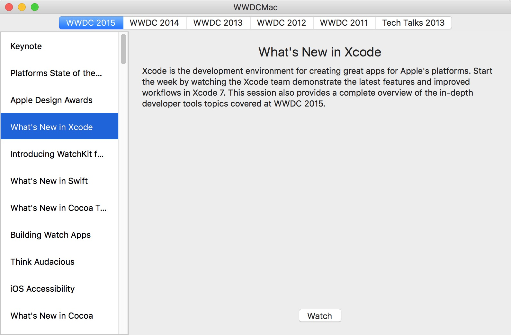
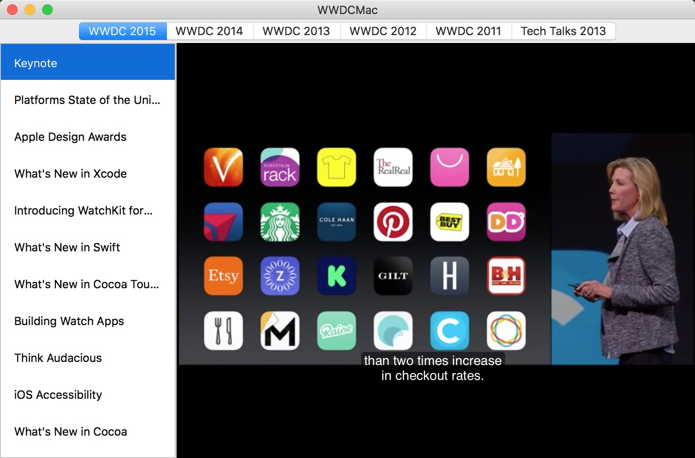

# WWDCMac

A WWDC Mac client in Swift. You can watch all WWDC videos on it.

## Feature
* WWDC 2011 - 2015 videos, include "Teck Talks 2013" videos
* Switch year very convenient
* Support subtitles
* Support fullscreen

## Screenshot

## TODO
* Cache videos in local